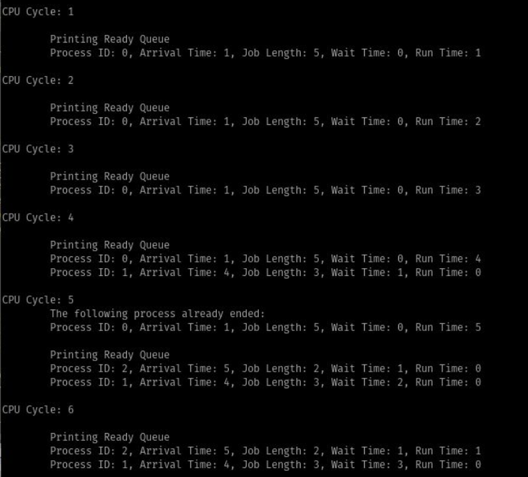

---
title: "Process Scheduling"
author: [JAC Hermocilla]
date: "\\today"
subject: "Markdown"
keywords: [Markdown, Example]
header-left: "CMSC 125 | Operating Systems (Laboratory)"
header-center: ""
header-right: "Process Scheduling"
footer-left: "Revision: \\today "
footer-center: "\\thepage"
footer-right: "\\theauthor | ICS-UPLB"
titlepage: true
...

# Assessment Tool

Given a `template.c`, implement the simulation of the **Shortest Remaining Processing Time (SRPT)** algorithm in a given list of processes. The following are the descriptions of the functions in template:

- `int ReadProcesses(int *arrival_time, int *job_length)` - This function reads the list of processes from `process.txt` where the first line is the process count and the succeeding lines contain a pair of the process’ arrival time and job length. You may assume that the processes are sorted in ascending order by arrival time.

- `void RunSimulation(int *arrival_time, int *job_length, int process_count)` - This function simulates the SRPT scheduling algorithm. For every cpu cycle, it manages the processes in the ready queue (e.g. enqueue newly arrived processes, updates run time and waiting of process in the queue).

- `void Processing()` - This function simulates processing of a single CPU cycle. It updates run time and waiting of process in the queue and removes terminated processes from the queue.

- `void Enqueue(int process_id, int arrival, int job_length)` - This function inserts the new process in the ready queue.

- `void Dequeue()` - This function removes the terminated process, which is found at the head of the queue.

Sample Run Output:

## Acknowledgment

This material builds on top of the contributions by former CMSC 125 instructors: Joman Encinas, Chris Templado, Betel de Robles, Zenith Arnejo, Berna Pelaez 

## License

This document is licensed under [CC BY-SA 4.0](https://creativecommons.org/licenses/by-sa/4.0/)
